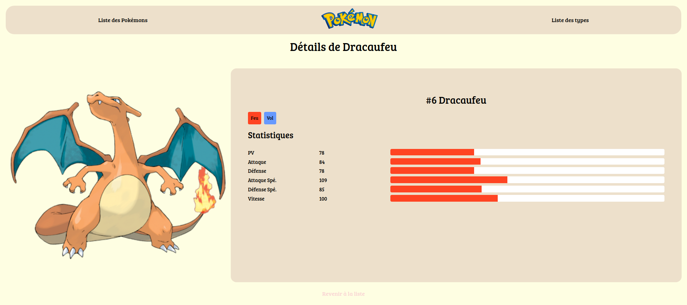

# Pokédex

## Etapes pour ititialiser le projet

### Installer les dépendences :
  
`npm init`

`npm install dotenv ejs express nodemon pg`

### Creer la database avec postegres et injecter le fichier pokedex.sql

`sudo -i -u postgres psql`

`CREATE USER nomDeLutilisateur WITH PASSWORD 'motDePasse';`

`CREATE DATABASE nomDeLaDataBase OWNER nomDeLutilisateur;`

`psql -U numUtilisateur -d nomBaseDeDonnees -f pokedex.sql`

### Renseigner le fichier .env.example

Ajouter le nomDeLutilisateur, motDePasse,nomDeLaDataBase dans l'url de connection à la base de données.
Supprimer le .example

### Lancer le serveur 
  
`nodemon index.js`
  

## Rendu visuel du projet 

### Page d'accueil

.

### Page détails

.

